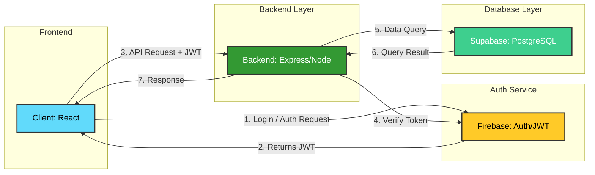

# System Architecture Overview

This document outlines the technical architecture for the application, highlighting the interaction between the React frontend, Node.js backend, and the external services for Auth and Data.

## Architecture Diagram

